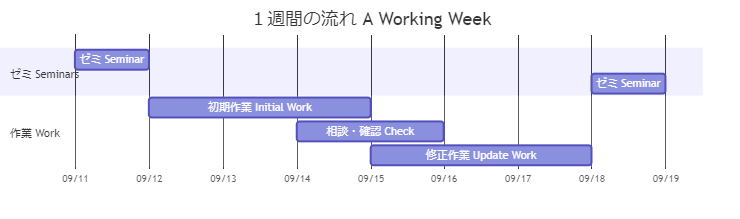
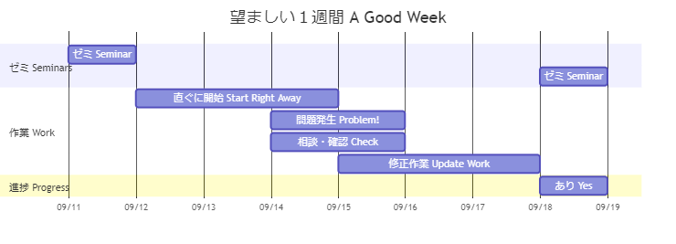
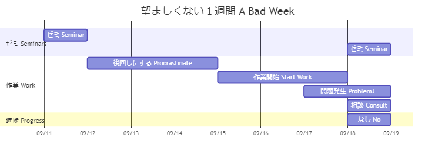

# １週間の流れ

## モデル

- 研究に想定外の問題はつきもの
- いかに早く問題に直面し、解決し、予定したタスクを完了するかが大切
- 望ましい１週間を増やし、望ましくない１週間を減らすのが時間管理

## 望ましい１週間

- 直ぐにタスクに着手する
- 問題に直面するが、指導教員に相談・確認する時間的余裕がある
- 問題を解決したうえで、当初予定していたタスクを完了すす
- 望ましくない１週間と比較すると進捗が倍になる

## 望ましくない１週間

- 直ぐにタスクに着手しない
- 直ぐに着手しないので、問題が発生したときに、相談する時間がない
- ゼミで問題を相談する
- 望ましい１週間と比較すると進捗が半分になる
