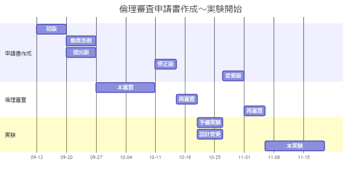

# 倫理審査申請

## :warning: 注意点

- すべてのユーザ研究を開始する前に、倫理審査委員会から承認を得る必要があります。例外はありません。
- 倫理審査申請書の受付は、**毎週月曜日**です。火曜日に提出したものは次週の月曜日まで審査対象になりません。
- 倫理審査には2週間かかり、修正版の審査にも数日かかります。

## 申請書作成から実験開始まで

- 倫理審査申請書の作成開始から本実験の開始まで2か月弱かかるのが一般的です。
- 予備実験を行うことは必須で、実験計画を修正しますが、修正内容も審査対象です。
- 実験計画をしっかり練ることや、申請書を丁寧に書くことが、実験に早く着手する早道です。

## 審査待ち期間の時間の使い方

:bulb: 審査結果を待っている間は以下の作業を進めましょう。

- 実験システムの最適化
- 論文の方法の章の執筆
- 参加者募集案内の作成
- 実験管理書類の作成
- データ分析方法の学習（疑似データを使う）
